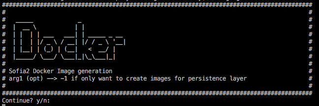
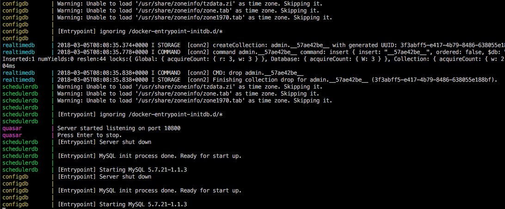
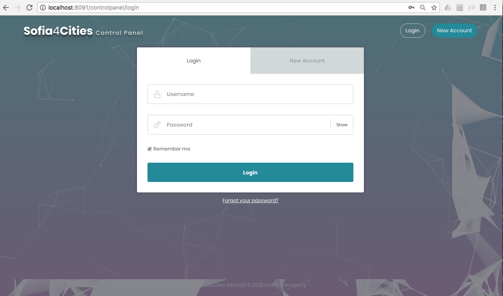

# Sofia2 Open Suite Development Environment
### Steps to launch a deployment of the Platform in local environments with Docker containers

* [Step 1: Install Docker and Docker Compose](#install)
* [Step 2: Compile the sources with Maven to generate the artifacts (.jar)](#compile)
* [Step 3: Generate Docker images of the platform](#dockerbuild)
* [Step 4: Launch the execution of containers in the persistence layer](#composedata)
* [Step 5: Loading tables and data in configdb and realtimedb](#loaddata)
* [Step 6: Launch the execution of the containers of the platform modules](#composemodules)

#### Step 1: Install Docker and Docker Compose

It is necessary to have installed Docker and Docker Compose, for this you have to follow the instructions from the official Docker website. If Docker is already installed, skip to Step 2.

- Docker for Windows: https://docs.docker.com/docker-for-windows/install/
- Docker for Linux: https://docs.docker.com/install/linux/docker-ce/ubuntu/
- Docker for MacOS: https://docs.docker.com/docker-for-mac/

- Docker Compose: https://docs.docker.com/compose/install/

#### Step 2: Compile the sources with Maven to generate the artifacts (.jar)

From the root of the project execute: **mvn clean install -Dmaven.test.skip = true** (In this step we can skip the tests)

#### Step 3: Generate Docker images of the platform

Within the docker-deployment directory we execute the script **./image-generation.sh**, this will generate all the necessary images of the platform in the Docker local registry.

#### Step 4: Launch the execution of containers in the persistence layer

In the **docker-deployment / data** directory, in a shell, we execute docker-compose up, this will launch the persistence layer of the Platform
(configdb, schedulerdb, realtimedb and quasar) with Docker containers, once you have finished, go to Step 5.

To stop the containers: **ctrl + c** and write **docker-compose down**

#### Step 5: Loading tables and data in configdb and realtimedb

Once the containers of the persistence layer have been activated it is necessary to create tables (configdb) and collections (realtimedb) and close them with data, for that in the **config/init** directory we execute mvn spring-boot: execute

#### Step 6: Launch the execution of the containers of the platform modules

In the **docker-deployment / modules** directory we execute, in a different shell, **docker-compose up** to launch Platform modules (**Control Panel**, **IoT Broker** and **API Manager**)

Once the containers of all the modules are up and running, we can access the Control Panel by putting the following url in the web browser: http://localhost:8091/controlpanel

